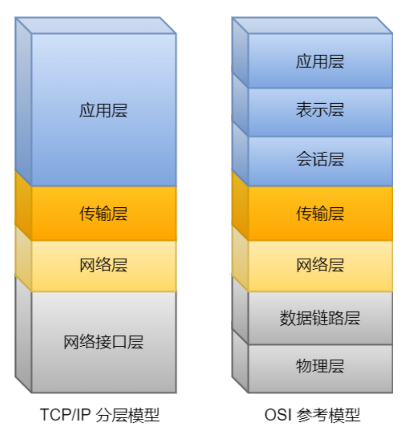
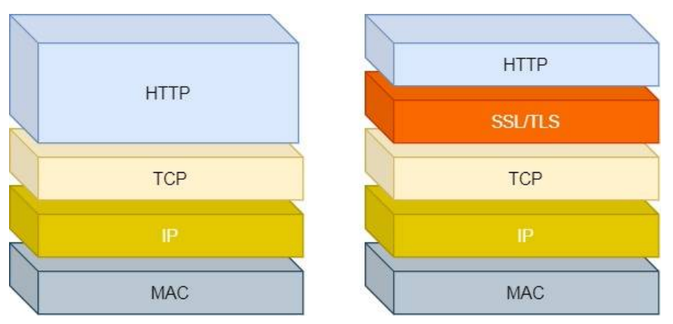
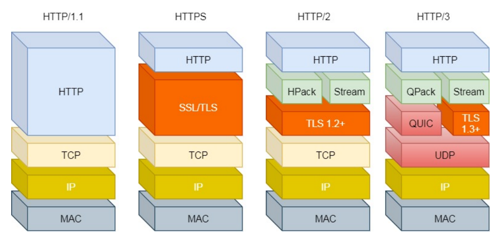

# 网络

## 基础
### 1. TCP/IP网络模型

- #### 应用层（Application Layer）
  
- #### 传输层（Transport Layer）
  为应⽤层提供⽹络⽀持
  
> TCP
> 
> 传输层控制协议（Transmission Control Protocol）
>
> UDP
> 

- #### 网络层（Internet Layer）
  
>  IP 协议（Internet Protocol）
> 
> 路由
> 
> IP 协议的寻址作⽤是告诉我们去往下⼀个⽬的地该朝哪个⽅向⾛，路由则是根据「下⼀个⽬的地」选择路
径。寻址更像在导航，路由更像在操作⽅向盘。

- #### 数据链路层(Data Link
Layer)

> 路由器
> 
> ARP 协议

- #### 物理层（Physical Layer）

## HTTP

HTTP 是超⽂本传输协议，也就是HyperText Transfer Protocol。

HTTP 协议是⼀个双向协议。

### 状态码
 
#### 1xx
1xx 类状态码属于提示信息，是协议处理中的⼀种中间状态，实际⽤到的⽐较少。

#### 2xx
2xx 类状态码表示服务器成功处理了客户端的请求，也是我们最愿意看到的状态。

「200 OK」是最常⻅的成功状态码，表示⼀切正常。如果是⾮ HEAD 请求，服务器返回的响应头都会有 body
数据。

「204 No Content」也是常⻅的成功状态码，与 200 OK 基本相同，但响应头没有 body 数据。

「206 Partial Content」是应⽤于 HTTP 分块下载或断点续传，表示响应返回的 body 数据并不是资源的全部，⽽
是其中的⼀部分，也是服务器处理成功的状态。

#### 3xx
3xx 类状态码表示客户端请求的资源发送了变动，需要客户端⽤新的 URL ᯿新发送请求获取资源，也就是重定
向。「301 Moved Permanently」表示永久᯿定向，说明请求的资源已经不存在了，需改⽤新的 URL 再次访问。

「302 Found」表示临时᯿定向，说明请求的资源还在，但暂时需要⽤另⼀个 URL 来访问。
301 和 302 都会在响应头⾥使⽤字段 Location ，指明后续要跳转的 URL，浏览器会⾃动᯿定向新的 URL。 「304 Not Modified」不具有跳转的含义，表示资源未修改，᯿定向已存在的缓冲⽂件，也称缓存᯿定向，⽤于缓
存控制。

#### 4xx

4xx 类状态码表示客户端发送的报⽂有误，服务器⽆法处理，也就是错误码的含义。

「400 Bad Request」表示客户端请求的报⽂有错误，但只是个笼统的错误。

「403 Forbidden」表示服务器禁⽌访问资源，并不是客户端的请求出错。

「404 Not Found」表示请求的资源在服务器上不存在或未找到，所以⽆法提供给客户端。

#### 5xx

5xx 类状态码表示客户端请求报⽂正确，但是服务器处理时内部发⽣了错误，属于服务器端的错误码。

「500 Internal Server Error」与 400 类型，是个笼统通⽤的错误码，服务器发⽣了什么错误，我们并不知道。

「501 Not Implemented」表示客户端请求的功能还不⽀持，类似“即将开业，敬请期待”的意思。

「502 Bad Gateway」通常是服务器作为⽹关或代理时返回的错误码，表示服务器⾃身⼯作正常，访问后端服务器
发⽣了错误。

「503 Service Unavailable」表示服务器当前很忙，暂时⽆法响应服务器，类似“⽹络服务正忙，请稍后᯿试”的意
思。

### 常见字段
#### Host 字段
#### Content-Length 字段
#### Connection 字段
#### Content-Type 字段
#### Content-Encoding 字段

### GET与POST
#### GET
Get ⽅法的含义是请求从服务器获取资源，这个资源可以是静态的⽂本、⻚⾯、图⽚视频等。

#### POST

#### http与https区别

#### http与https区别

## TCP

## IP

## 综合
