# ~~把PMP写进代码？~~
# 十大知识领域
## 第 4 章 整合管理


### 4.3 指导与管理项目工作：3 输出(4 变更请求) 
### 4.4 管理项目知识：1.输入 
### 4.6 实施整体变更控制 
### 4.7 结束项目或阶段

## 第 5 章 范围管理


### 5.1 规划范围管理：3 输出 
### 5.2 收集需求：2.工具与技术/3 输出 
### 5.3 定义范围：3 输出（1 项目范围说明书） 
### 5.4 创建 WBS：2 工具与技术（2 分解）/3.输出（1.范围基础） 
### 5.6 范围控制：2 工具与技术

## 第 6 章 进度管理


### 6.2 定义活动:2 工具与技术（2 分解/3 滚动式规划）3 输出 
### 6.3 排列活动顺序：3 输出（1 项目进度网络图 
### 6.4 估算活动持续时间：2 工具与技术 
### 6.5 规定进度计划：2 工具与技术预算：3 输出(1 成本基准)

## 第 7 章 进度管理


### 7.2 估算成本：2 工具与技术 
### 7.3 制定预算：3 输出(1 成本基准) 
### 7.4 控制成本：2 工具与技术/3 输出

## 第 8 章 进度管理


### 8.1 规划质量管理—3.输出内容 
### 8.2 管理质量—2 工具与技术

## 第 9 章 进度管理


### 9.1 规划资源管理—2、工具与技术 
### 9.2 估算活动资源—2.工具与技术 
### 9.3 获取资源—2 工具与技/3.输出 
### 9.4 建设团队—2.工具与技术

## 第 10 章 进度管理


### 10.1 规划沟通管理—2.工具与技术/3.输出 
### 10.2 管理沟通—2.工具与技术/3.输出

## 第 11 章 风险管理


### 11.2 识别风险—-2.工具与技术

## 第 12 章 采购管理


### 12.1 规划采购管理—-2.工具与技术/3 输出 
### 12.2 实施采购—-1 输入/3.输出 
### 12.3 控制采购—1.输入/2.工具与技术

## 第 13 章 相关方管理


### 13.1 识别相关方—2.工具与技术/3.输出 2 管理质量—2 工具与技术

# PMBOK 中的输入输出工具规律
1. 强调统计技术的3 个工具：问卷调查，统计抽样，预期货币价值分析
2. 使用储备分析工具的5 个过程：6.4 活动持续时间估算，7.2 估算成本，7.3 制定预算，7.4 控制成本，11.7 监督风险,
3. 规划过程组的过程，四个在输出中出现变更请求的过程：定义活动、制定进度计划、规划采购管理、规划风险应对
4. 4-13 章，每一章都有过程用到专家判断工具
5. 监控过程组中，输出唯一没有变更请求的过程：4.5 整体变更控制，4.5的输出是批准的变更请求。
6. 执行过程组中，输出中没有变更请求的3 个过程：4.4管理项目知识 9.3获取资源10.2 管理沟通
7. 启动过程组的识别相关方，输入中有项目管理计划
8. 规划过程组的所有过程，输入中都有项目管理计划，除了4.2制定项目管理计划
9. 执行过程组的所有过程，输入中都有项目管理计划
10. 监控过程组的所有过程，输入中都有项目管理计划
11. 收尾过程组的一个过程，输入有项目管理计划
12. 启动过程组，规划过程组、执行过程组、监控过程组、收尾过程组输出中都可以出现“项目文件更新”，大部分都有，
    除了4.1 ，4.2 ,5.1 ，6.1 ，6.2 ，7.1 ，11.1 ，13.2 ，4.4 ，9.3。
13. 过程的输入中包括“项目章程”：
    - 4.2 制定项目管理计划、4.7结束项目或阶段、
    - 5.1 规划范围管理、5.2收集需求、 5.3 定义范围、
    - 6.1规划进度管理、
    - 7.1规划成本管理、
    - 8.1规划质量管理、
    - 9.1规划资源管理、
    - 10.1规划沟通管理、
    - 11.1规划沟通管理、
    - 12.1规划采购管理、
    - 13.1 识别相关方、 13.2规划相关方参与。
14. “检查”作为工具在 5.5 确认范围、8.3 质量控制、12.3控制采购三个过程出现
15. 自下而上估算出现在三个过程：6.4估算活动持续时间，7.2 估算成本，9.2 估算活动资源

# 合同类型选择的思路：
- 一看：范围明确不明确；
- 二看：管理内行还是外行；
- 三看：身份买方还是卖方；
- 四看：时间紧急不紧急

1. 范围明确不明确。
- 假如范围明确，通常选择总价类；
- 假如范围不明确，通常选择成本补偿类和工料合同。
- 如果是卖方，通常选择成本补偿类；
- 如果是买方呢，要看是不是内行，如果内行，选择成本补偿合同，可以很好的参与项目；
  如果是外行，通常选择工料合同；
2. 身份是买方还是卖方，选择相对风险小的。
   如果是买方，总价类中固定总价合同FFP风险最小，成本补偿类中的CPIF风险最小。
3. 时间紧急不紧急，一般时间紧急有项目都是选择工料合同。
4. 需不需要增加人员、聘请专家以及寻求其他外部支持。

在不能很快编写出准确工作说明书的情况下，经常使用工料合同来增加人员、聘请专家以及寻求其他外部支持。

一般需要增加人员、聘请专家以及寻求其他外部支持的项目选择工料合同。

工料合同适用于短期和小金额的项目，不适用于长期。

# PMBOK 知识点归纳分析
## 引论
1. 预测型生命周期：瀑布型，最早期就有范围、时间和成本，管理变更
2. 迭代型生命周期：循环活动
3. 增量型生命周期：逐渐增加功能
4. 适应型生命周期：敏捷型或变更驱动型
5. 混合型：预测型和适应型相结合，边开发边使用。
6. 工作绩效数据——原始观察结果；  
   工作绩效信息——数据与基准进行对比的总结，用户挣值管理和趋势分析；  
   工作绩效报告——信息整理成报告的模式用于汇报。

7. 项目商业论证：文档化的经济可行性报告，包括商业需求和成本效益分析。
8. 项目效益管理计划：包括目标效益、战略一致性、时限、效益测量方法和相关指标。

## 项目运行环境
1. 事业环境因素(EEF)：硬件和标准。  
   如：组织文化，基础设施，行业标准，商业数据库。
2. 组织过资产(OPA)：过程，政策和程序，知识库。  
   如：模板，流程，指南，经验教训。
3. PMO 项目管理办公室：是对与项目相关的治理过程进行标准化，并促进资源、方法论、工具和技术共享的一个组织结构。
   这个组织可以提供培训，但是不负责解决项目内的问题。默认是支持型。 P48 PMO

## 项目经理角色
1. PMI 人才三角：领导力，技术能力，战略和商务管理

## 项目整合管理
1. 5 大过程组，10 大知识领域，49 个管理过程，80 个输入输出和 132 个工具技术需要熟记。
2. 每个管理过程的ITTO，可以不完全背下来，但是需要了解。
3. 项目章程：输入商业文件和协议（SOW）。启动项目，和授权项目经理使用组织资源开展项目工作，包含成功标准和退出标准。
4. 商业文件：商业论证和效益管理计划。
5. 商业论证：商业需求和成本效益分析。P78 上半部的例如。
6. 配置管理计划，版本相关的。
7. 启动大会（initial meeting）、开工（踢）会（kick-off meeting）。
8. 数据收集技术：
   - 焦点小组（focus groups）、
   - 引导式研讨会（facilitated workshops）、
   - 访谈（interviews）、
   - 问卷调查（questionnaires and surveys）、
   - 观察（observations）
9. 增加项目经理的职责：项目经理被要求介入启动和结束项目，例如开展项目商业论证和效益管理。  
   按照以往的惯例，这些事务均由管理层和项目管理办公室负责。  
   现在，项目经理需要频繁地与他们合作处理这些事务，以便更好地实现项目目标以及交付项目效益。项目经理也需要更全面地识别相关方，
   并引导他们参与项目，包括管理项目经理与各职能部门、运营部门和高级管理人员之间的接口。P73
10. 项目管理计划和项目文件的区别，需要了解大概，记住 18 个子计划。

## 范围题
1. 需求跟踪矩阵，将用户需求连接到最终可交付成果的表格。可以用作持续跟踪用户需求的完成情况和验收时确认满足范围的依据。
2. 范围的变更，遵循范围管理计划及变更管理计划。
3. 需求，要求和功能都属于范围，如果需要变更则需要遵循如下顺序：  
   1）项目管理计划。  
   2）范围管理计划。  
   3）变更管理计划。（需求管理计划、配置管理计划）

## 进度题
1. 进度压缩技术：  
   1）.赶工，增加资源，加班，以最小的成本代价压缩进度。  
   2）.快速跟进，将原来按顺序进行的活动或阶段改为至少部分并行。
   
2. 钱充足，进度落后，优选赶工；钱不够，进度落后，优选快速跟进或并行。
3. 进度落后，在不影响基准的前提下，不选提交变更。
4. 类比估算和参数估算

- 参数估算：  
利用历史数据的统计关系和其他变量，来估算成本、预算或持续时间等。  
如已知历史单价，来估算未来的总价。  
特点是需要依据参数模型，有单价，适用于重复性工作。照搬历史数据，直接估算当前所需数据。

- 类比估算：  
利用过去类似项目的参数值，来估算未来项目的同类参数或指标。  
如已知过去类似项目的单个活动的单价，来估算未来项目的单个活动的单价。  
特点是针对同类参数，照搬历史数据，速度快，成本低。

## 挣值管理
1. 相关概念：PV, EV, AC, SV, CV, CPI, SPI, BAC, EAC, TCPI, 关键比率（CPI*SPI）

PV：计划单价*计划工作量

EV：计划单价*实际工作量

AC：实际单价*实际工作量

2. ETC 和 EAC 的计算

> 1.1 特殊原因的偏差，今后不会持续
> 
> ETC=BAC-EV
> 
> EAC=AC+ETC/(CPI*SPI)=AC+（BAC-EV）/(CPI*SPI)=BAC-CV=BAC/CPI

> 1.2 一般原因的偏差，今后会持续
> 
> ETC-(BAC-EV)/CPI
> 
> EAC=BAC/CPI

3. SV、CV 大于 0，好；小于 0，不好；CPI、SPC 大于 1，好；小于 1，不好；

4. 单独的 SPI 值无法判断项目的进展情况，因为 SPI 考察的是总体工作量，并未考虑关键路径；

5. TCPI =（BAC – EV）/（BAC – AC）
   
   TCPI 的意义，为了达到最初的管理目标，剩余的资源必须达到的成本绩效指标。

## 质量题
1. 预防胜于检查。
2. 确保、避免和防止质量问题，选质量保证。
3. 质量保证重在增加相关方对于质量管理的信心，着眼于过程。
4. 质量审计是质量保证的重要工具，也是针对过程，政策和方针。
5. 面向 X 的设计可以降低成本、改进质量、提高绩效和客户满意度。
6. PDCA 和（精益 LEAN）六西格玛是两种重要的质量改进工具。
7. 质量控制工具：  
   1）因果图找根本原因  
   2）控制图控制过程  
   3）直方图分类显示大部分问题的主要原因（2/8 原理）4）散点图找两个变量之间的关系
8. 控制质量的作用和测试一样，输出核实的可交付成果，下一步就是验收。
9. 缺陷补救和检查针对可交付成果；预防措施、纠正措施和审计针对管理过程，但不影响基准；更新是需要改变基准。
10. 批次发生缺陷，一般使用的方式是统计抽样。

## 资源题
1. 资源优化技术：  
   1）资源平衡  
   2）资源平滑
2. 资源平衡可能会造成基准发生变更；资源平滑不会造成基准变更。
3. 资源被过度利用，使用不均时，优选资源平衡
4. 资源不足的情况下追赶进度时，优选资源平滑
5. 资源请假或者被抽调，需要先进行分析，  
   如果会影响进度，按识别风险处理；  
   不影响进度，按问题处理，需要继续跟进。  
   （关键）资源被调走，可以按照风险识别处理。
6. 资源分布在不同的地域或区域，更有可能考的是虚拟团队。
7. 团队技能不足，首选培训。  
   如果时间紧张，需要与职能经理申请额外的资源。  
   如果是为了获得项目，并且组织内没有相关资源，则需要招募。
8. 资源不足，且被过度分配，选择资源平衡，有可能改变关键路径。
9. 资源平滑，削峰填谷，有可能提高工作绩效。
10. 共享资源的问题处理：  
    1）资源平衡   
    2）按照风险识别。

## 团队问题
1. 五种冲突处理方式：
   - 撤退/回避，
   - 缓解/包容，
   - 妥协/调节，
   - 强迫/命令，
   - 合作/解决问题.
2. 没有提及进度或时间紧张时(需要一劳永逸的解决问题，双赢)，优选解决/合作；时间紧迫(立即)，通常选命令/强迫。
3. 团队或相关方有问题，应当先了解问题发生的原因，然后积极主动的解决问题，如：约谈，开会，了解原因等。
4. 成员有问题，遵循问题处理升级流程；  
   首先私下口头沟通，了解原因，如无效则正式书面或会议提出或警告，再无效则约谈其直线经理，最终无效则开除。
5. 团队内部冲突，使用基本规则，团队规范等可以减少冲突。
6. 团队间冲突，与团队管理者沟通解决问题。

## 沟通问题
1. 沟通的几种方式：1）拉式沟通 2）推式沟通 3)互动沟通
2. 互动式沟通最有效，但是耗时最长。

## 相关方题
1. 识别干系人，项目上出现了新的干系人，首先要识别干系人
2. 权力利益方格，职权级别和对项目成果关心程度，4 个象限对应 4 种管理策略。
3. 新出现的相关方提出变更，更新变更日志，相关方登记册，沟通管理计划。
4. 相关方参与度评估矩阵，评估相关方当前的参与程序与预期的参与程度的差距的工具。
5. 团队成员也可以当做相关方来管理。
6. 积极主动的沟通策略（包括开会）是控制相关方参与的首选工具。

## 风险题
1. 识别风险阶段，遵照风险处理流程
2. 风险发生阶段，应该怎么做：应遵照变更管理流程，采取风险应对措施
3. 风险已经发生，下一步做什么：更新风险登记册或审查风险登记册（不能更新风险管理计划），提交变更请求，实施应对计划。
4. 如何减轻风险,准备或实施风险应对
5. 财务风险适合转移措施，买保险或者外包到第三方
6. 开拓风险，派遣组织中最有能力的资源到项目来缩短工期
7. 定性风险分析，分析发生概率并进行优先级排序；定量风险分析，
8. 定量风险分析，决策树（EMV），路径净值（净路径值）
9. 衡量两种或两种以上可选方案的利弊时，使用决策树和预期价值 EMV，或成本效益分析。
10. 风险应对策略中，与第三方有关的--转移/分享；与概率和影响有关的--减轻/提高；与风险本身相关的--规避/开拓。

## 管理计划相关
1. 项目管理计划及其附属计划的变更都需要遵循整体变更控制流程，不要轻易选直接更新管理计 划的答案。
2. 管理计划中只有管理相关方面的方法论，讲的是 how 而不是 what，故不包含具体的解决方法。  
   如题中问如何应对风险，不能选审查风险管理计划等，风险应对策略在风险登记册中。如何管理风险，要根据风险管理计划。
3. 沟通管理计划和相关方管理计划是比较特殊的，因为其中包含一些不受控的项目文件内容，项目经理可以直接更新。

## 采购题
1. 合同类型： 
- 封口合同：固定总价合同（FFP），总价加激励费用（FPIF），总价加经济价格调整（FP-EPA） 
- 敞口合同：成本加固定费用（CPFF），成本加激励合同（CPIF），成本加奖励费用（CPAF）
- 特殊敞口合同：工料合同（T&M）
  
|种类| |合同类型|缩写|描述|
|:---|:---|:---|:---|:---|
|总价合同|闭口合同|固定总价|FFP|合同价格固定，除非范围发生变化|
| | |总价加激励费用|FPIF|根据分摊比例，买方卖方分享收益或者损失，通常规定“最高限价”|
| | |总价加经济价格调整|FP-EPA|总价根据经济价格进行调整，保护双方免受通胀、汇率的影响|
| |特殊敞口|工料合同|T&M|混合型合同，兼具总价合同和成本补偿合同的特点，按照时间和实际材料费用付款的合同
|成本补偿合同|敞口合同|成本加激励费用|CPIF|报销成本，并根据分摊比例，双方分享收益或者损失|
| | |成本加奖励费用|CPAF|报销成本，并根据买方的主观判断给予奖励|
| | |成本加固定费用|CPFF|报销成本，外加固定费用的利润|
| | |成本加百分比|CPPC|报销成本，并按照约定的成本的百分比付给卖方利润|
  
2. 合同特点： 
- 总价合同：工作类型可以预知，需求和范围定义清晰的
- 成本补偿合同：范围可能随时发生变化，风险高，工作复杂
  （成本加奖励合同的适用场景一般是题目中有明确的需要甲方根据主观判断的条件）
- 工料合同：范围没有清晰定义，工作不复杂，需快速签订合同，
  不能很快编写工作说明书，增加人手，专家或寻求外部支持时适合使用工料合同。
3. 合同的应用场景

考虑绩效的，选用激励类合同

考虑范围固定的，选用总价类合同

条件中有甲方说的算的条件，选用成本加奖励费用合同

长期合作，对双方都有利的，选用总价加经济价格调整合同

范围不明确，需要快速签订，选用工料合同（工料合同可以预定最高限价，但是甲方有项目拖延的风险）

4. 控制采购的工具：

绩效审查：综合的针对卖方履约能力或合同执行情况，包括成本\进度\范围\质量等

检 查：针对可交付成果与合同的符合程度

审 计：针对卖方工作过程遵守管理计划的程度

## 变更相关
1. 变更的分类
> - 1.1 纠正措施：针对流程或者程序的问题，对应审计。
> - 1.2 预防措施：针对流程或者程序，为了确保未来的绩效符合项目管理计划。
> - 1.3 缺陷补救：针对可交付成果问题，对应检查。 
> - 1.4 更新 ：为了适应某种变化而提前变更受控的项目文件、计划或基准的行为。
> 
2. 确保项目整个生命周期中，所有的变更都要通过整体变更控制流程，项目中应该严格杜绝镀金和范围蔓延，
   已经发生镀金或范围蔓延的情况，应该视情况而定，对于必要的变更行为，需要补变更流程。
3. 关于变更的所有信息都应该记录在变更日志中。
4. 预防措施、缺陷不久、纠正措施，只是针对基准的实施工作产生影响，并不影响基准。
   但是更新是需要变更基准的。
5. 不符合客户要求，不符合计划，有缺陷，有错误等，遵循整体变更控制流程，
   或在答案中找变更流程中的步骤对应的选项。

## 杂记总结
1. 问题问项目经理需要使用什么？要参考什么？考虑什么？一般都是在考 ITTO
2. 不要选陌生词汇，除非你明确知道他的英文意思。
3. 若非问题升级，不要轻易麻烦发起人。例如超出项目预算或者商业目标发生改变的问题，可以上报发起人，最好选带着解决方案一起汇报的答案。
4. 如果是普通的具体问题，一定选积极主动且能够解决问题的答案，不要轻易麻烦职能经理。如：  
法律部门，人力资源经理，生产经理。如：外包商违约，可以审查采购管理计划或合同等，不要找法律部门，除非到达了诉讼的地步。
5. “管理一个新项目”，“启动一个新项目”，和项目章程有关
6. 新任项目经理应该首先获得项目章程的批准，或者利用经验教训评估项目。
7. “高层级的。。。”在项目章程中。
8. 问题是已经发生的并且需要跟踪处理并解决的事情；通常不需要当下立刻解决。
9. 风险是对项目目标有影响的可能性；需要对之进行分析并规划应对方案。
10. 英文缩写概念：

OBS（组织分解结构）：将组织分解成部门，单元或团队，可配合 WBS 使用在每个部门下列出项目活动或工作包。

RBS（资源分解结构）：按照资源的类型（人、材料、设备等）和类别（等级，水平），对团队和实物资源的层级列表 。
资源分解结构有助于结合资源的使用情况，组织与报告项目的进度数据。

RBS（风险分解结构）：潜在风险来源的层级展现 。可以用来表示不同类型的风险与项目活动或过程之间的对应关系。

WBS（工作分解结构）：自上而下的奖项目可交付成果分解 ，可以按照子项目、可交付物或者阶段进行 100%分解，可滚动式规划，一般分为 2-6 层。
CA（控制账户）是 WBS 的一个管理控制 点，结合范围、预算、实际成本和进度加以整合，并与挣值比较，进行绩效测量。
规划包是 WBS组件，位于 CA 之下，工作内容已知，但详细的进度活动未知。

RAM（责任分配矩阵）：展示项目资源在工作包中的分配情况，用于说明项目团队成员与工作包或活动之间的关系；
能反应与每个人相关的所有活动，或与每个活动相关的人员，确保每个任务都有一个人负责。或典型的应用如 RACI（执行、负责、咨询和知情）矩阵。

RACI矩阵

|活动\人员|安|本|卡洛斯|迪娜|艾德|
|:---|:---|:---|:---|:---|:---|
|创建章程|A |R |I |I |I|
|收集需求|I |A |R |C |C|
|提交变更请求|I |A |R |R |C|
|指定测试计划|A |C |I |I |R|

R=负责 A=问责 C=询问 I=知情

12. 项目经理下一步该做什么？
需要在答案当中选择和接下来要做的步骤最接近的步骤，以此类推（也可能是一套解决方案）。
13. 项目经理应该怎么做？
着重于解决问题，可以审查 xx 管理计划（优先级高），或者要选一个有效地解决方案。
14. 发生了一个事情，导致了一项后果，项目经理应该通过什么来避免？  
通常都是预防或者减轻措施，一般发生在规划阶段或者更早。  
可以把这个事情看做是一个风险，风险需要提前规划应对措施来应对风险。
15. 遇到关键相关方不审批的怎么办？  
要动用项目经理的个人技能，不能直接上报。如果问题升级需要上报，上报也要带着解决方案。一般来说与其开会或了解原因是最佳答案。
16. 主动联络发起人的选项轻易不要选，除非遇到超出项目层面的问题。如：遇到了未知的未知风
险，且无法通过权变措施来解决，可以考虑选择上报发起人。或商业目标发生变化，需要与发起人沟通。

# 计算题
## 一、第6章 项目进度管理 
1. 估算活动持续时间：三点估算（PERT） 可引申至估算成本、评估进度风险......
- 三点估算法（PERT)：对单个活动无法进行确定估算时，就其乐观、悲观、最可能的估算进行加权平均的一种估算技术。
    - 三角分布：期望值=(乐观+最可能+悲观)/3
    - 正态（贝塔）分布：均值/期望值=(乐观+4×最可能+悲观)/6 
    - 标准差（SD）=(悲观-乐观)/6
    - 方差=[(悲观-乐观)/6 ]2，即标准差的平方
    
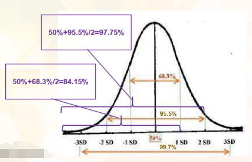

注：一个项目由若干个活动组成，我们关注的是项目的期望时间。
- 项目期望时间(均值) = 各个活动的期望时间(均值)的和
- 项目的方差 = 各个活动的方差的和
- 项目标准差 = 项目的方差的开二次方

在PMP考试中，只要题目中没有指明活动工期呈三角分布，均假设呈正态分布。
活动历时的PERT估算结果可用于关键路径分析（CPM）。

练习
> 1. 一个活动的历时估算如下：最乐观6天，最可能21天，最悲观36天。那么该活动在16-26天完成的几率有多高？  
>   A.54% B.68% C.95% D.99.73%  
>   解答：B。最可能=(6+21*4+36)/6=21，标准差=(36-6)/6=5，16-26在一个标准差内，即概率为68.3%。 
> 2. 某设备装备工作包含3个独立部件的生产环节，如果3个部件的生产周期最乐观是9天，最悲观是15天，最可能是12天，在14天内完成全部三个部件生产任务的概率是多少？  
> A.95.46% B.99.73% C.97.73% D.93.34%
> 解答：D。最可能=(9+12*4+15)/6=12，标准差=(15-9)/6=1，14天在两个标准差内，即一个部件完工概率为50%+95.5%/2=97.75%， 三个部件是97.75%*97.75%*97.75%=93.4%

2. 制定进度计划：关键路径法（CPM） 计算总浮动时间和自由浮动时间 
   
（1）CPM 
- 关键路径上可以有虚活动  
- 可能有多条关键路径  
- 关键路径的总浮动时间为0或负值  
- 进度压缩只能在关键路径上进行  
- 关键路径法不考虑任何资源限制  
- 关键路径决定项目能否按时完成

（2）计算：

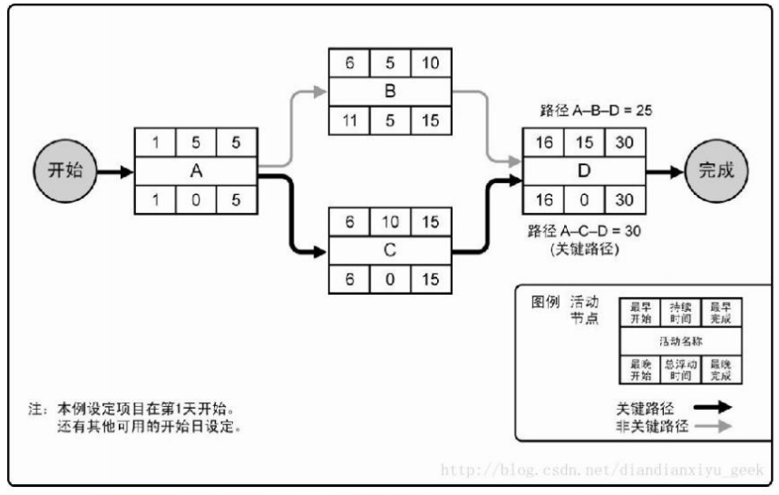

- 正推法:从左到右，加法取大。 
  - 任一活动最早开始时间=所有前置活动最早完成时间的最大者（如D）
  - 任一活动最早结束时间=该活动的最早开始时间+持续时间（如D）
    
- 逆推法:从右到左，减法取小。 
  - 任一活动的最迟完成时间=所有后续活动的最迟开始时间的最小者（如A） 
  - 任一活动的最迟开始时间=该活动的最迟完成时间-持续时间（如A）

> 1、一项活动的历时为4天，最早开始日期是10日，最迟开始日期是19日。没有非工作日。根据以上信息可以得出什么结论？ 
> 
> A.该活动总时差9天 B.该活动最早完成日期是14日 C.该活动最迟完成日期是25日 D.如果分配双倍资源的话，可以在两天内完成此项活动 
> 
> 解析：A
> 
> 2、如果任务B有12天的自由浮动时间，且有24天的总浮动时间。假设最早开始日期被推迟26天，那么项目的完工日期将会收到什么影响？ 
> 
> A.该任务将不会位于关键路径上 B.紧后活动的开始日期将被延后14天 C.项目的完工日期将延后2天 D.B和C 
> 
> 解析：C
> 
> 3、项目进度安排如图，目前工期18周，请问将工期压缩到17、16、15周时应压缩的任务及压缩后的成本？ 
> 
> 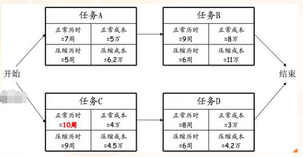
> 
> 解答：A-B共16周，C-D共18周，C-D是关键路径，总成本20万 
> 
> 压缩到17周，压缩任务C，10周压至9周，成本增加至20.5万； 
> 
> 压缩到16周，压缩任务D，8周压至6周，关键路径为A-B和C-D，成本增加21.2万； 
> 
> 压缩到15周，任务C和D均需压缩，压缩后C-D共15周，A-B是关键路径共16周，需压缩任务A，成本共计22.9万。
> 

## 二、第7章 项目成本管理 
挣值管理（EVM）

绩效测量最常用的方法 

（1）基本概念 
- 计划价值PV （截止某时点要完成的工作）= 计划完成工作 * 预算价格 
- 挣值EV （截止某时点已完成的实际工作）= 实际完成工作 * 预算价格 
- 实际成本AC （截止某时点已经发生的成本）= 实际完成工作 * 实际价格 
- 完工预算BAC（项目的成本基准） = 按计划进行的完成工作的全部预算 
- 完工估算EAC（在执行的不同时点重新估算的完成整个项目所需成本） = 按现有进度能完成工作的全部预算 
- 完工尚需估算ETC（在执行的不同时点重新估算的剩余工作所需成本） = 剩余工作按现有进度能完成工作的剩余预算

（2）计算 

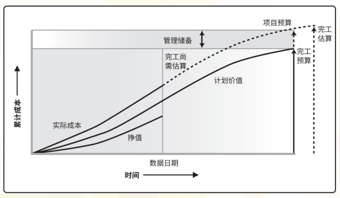

- 成本偏差分析 
  - 成本偏差 CV = EV - AC ,当前时间点计划的成本与实际的成本的差值， + 有利 ， - 不利 
  - 成本绩效指数 CPI = (EV/AC) , >1 有利 , <1 不利 
- 进度偏差分析 
  - 进度偏差 SV = EV - PV , 当前时间点实际完成的工作与按计划这个成本应该达到工作的差距 , + 有利 ，- 不利 
  - 进度绩效系数 SPI = EV / PV , >1 有利 ，<1 不利

趋势预测: 
- ETC:完工尚需费用预算 
  - 基于非典型的偏差计算(以后不会再发生类似偏差时): ETC = BAC-EV 
  - 基于典型的偏差计算 
    - 目前的成本偏差以后继续发生: ETC = (BAC-EV)/CPI 
    - 目前的成本绩效和进度绩效均不达标，但又必须按期完工：ETC = (BAC-EV)/(CPI*SPI) 
- EAC:完工总费用预算 
  - 使用新估算费用来计算：EAC = AC+ETC 
  - 使用剩余预算费用计算：EAC = AC+(BAC-EV) 
  - 使用CPI计算：EAC = AC+(BAC-EV)/CPI = BAC/CPI 
  - 使用SPI<1 计算：EAC = BAC/(CPI*SPI) 
- 完工总费用偏差VAC：VAC = BAC-EAC， + 有利 ， - 不利 
- 完工尚需绩效指数TCPI：为实现特定的管理目标，剩余资源的使用必须达到的成本绩效指标。>1 难以完成 , <1 轻易完成 
  - 为完成计划必须保持的效率：TCPI=(BAC-EV)/(BAC-AC) 
  - 为完成当前完工估算必须保持的效率：TCPI=(BAC-EV)/(EAC-AC)

EVT绩效指数的解读 

基于对EVT绩效分析的结果，CPI和SPI可能出现多种组态：


> 1、如果完工比例是60%，完工预算20000美元，实际成本15000美元，则成本偏差和进度偏差是多少？ 
> 
> A.CV=SV=-3000美元 B.CV=-3000美元，SV=-3000美元 C.CV=-3000美元，SV信息不足，无法计算 D.信息不充分，无法计算 
> 
> 解答：C。挣值20000*60%=12000美元，CV=EV-AC=12000-15000=-3000美元
> 
> 2、项目即将完工三分之二，EV=1000，BAC=1500，AC=1350，项目此时ETC是多少？ 
> 
> A.675 B.650 C.500 D.150 
> 
> 解答：A。CPI=EV/AC=1000/1350=0.74，成本超支，如按照该成本绩效继续，ETC=(BAC-EV)/CPI=(1500-1000)/0.74=675 
> 
> 3、一个设施施工项目正在进行中，30天后该项目实际成本为154000元，实现价值166000元。该设施总计划预算192000元，如果保持同样的施工效率，完成成本估算是多少？ 
> 
> A.198850 B.206961 C.178120 D.192000 
> 
> 解答：C。PV=166000，AC=154000，CPI=PV/AC=166000/154000=1.078。EAC=BAC/CPI=192000/1.078=178107
> 
> 

## 三、第10章 项目沟通管理 
沟通渠道

**沟通渠道：N×(N-1)/2** 
- N是利害关系人数量，包括内部和外部，也包括项目经理

练习
> 1、一个项目中有20个干系人，项目结束时，又确定了另外5个干系人，在项目结束时有多少条沟通渠道？ 
> 
> A.190 B.195 C.300 D.305 解答：C。(25*24)/2=300 
> 
> 2、编制沟通计划时，项目经理确定了10名干系人，之后，其中2名干系人离开项目，沟通渠道发生怎样的变化？
> 
> A.增加2个 B.增加17个 C.减少2个 D.减少17个 
> 
> 解答：D。原来(10*9)/2=45，现在(8*7)/2=28，减少45-28=17条

## 四、第11章 项目风险管理 
实施定量风险分析：决策树 可引申为项目决策、自制或外购决策...... 

期望货币价值（EMV）=风险时间概率×风险事件货币值

EMV一般与决策树一起使用，考虑概率和影响两个方面，用于决定一个组织应该选择什么项目。

EMV为正值表示机会，EMV为负值表示威胁

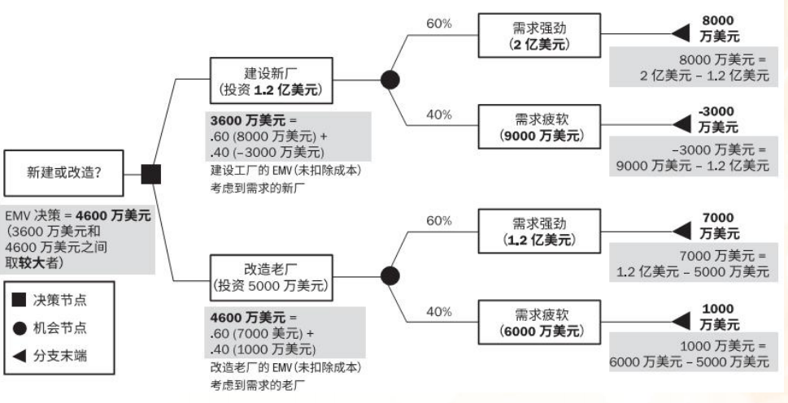

> 1、廉价的进口商品已经严重影响公司业务。公司组建一支项目团队开发新产品方案，希望在目前1亿营业收入基础上有所提高。项目团队起草两套方案： 产品A有40%的可能性将收入提高到1.5亿，但有30%的可能性因保证索赔使收入将至6000万，还有30%可能对收入没有影响。 产品B有50%的可能性将收入提高到1.3亿，但有20%的可能性因保证索赔和诉讼使收入将至8000万，还有30%可能对收入没有影响。 
> 
> A.产品A，EMV为1.08亿 B.产品B，EMV为1.11亿 C.产品A，EMV为1.11亿 D.产品B，EMV为1.08亿 
> 
> 解答：B。产品A的EMV=0.5*0.4+(-0.6)*0.3=0.02，产品B的EMV=0.3*0.5+(-0.2)*0.2=0.11 
> 
> 2、X产品将扩大规模以支持1000个用户的在线协作，项目团队向项目经理提交了两个选择方案，方案一购买并集成独立模块，成本6000美元，预计50%用 户可能使用该设备；方案二花费10000美元建设系统能力，预计70%用户可能使用该设备。根据预期价值分析，如果每个用户收取15美元，哪个方案最适合？
> 
> A.方案一，回报1500美元 B.方案一，回报500美元 C.方案二，回报1500美元 D.方案二，回报700美元 
> 
> 解答：A。方案一1000*50%*15-6000=1500，方案二1000*70%*15-10000=500

## 五、第12章 项目采购管理
1. 规划采购管理——自制或外购分析 
- 净现值（NPV）计算：反映投资方案在计算期内获利能力的动态评价指标。 
- 今天的一分钱要比明天的一分钱值钱（考虑资金的时间价值），价值随时间贬值，变动的幅度取决于利率和所考虑的时间段。 
  
> 现值=未来值/(1+折现率)n（n是计息周期）

> 1、如果根据7%的折现率，三年以后收到的8000美元的现值是多少？ 
> 
> A.9800 B.6530 C.9680 D.6612 
> 
> 解答：B。现值=8000/(1+0.07)3=6530 
> 
> 2、公司共有四个备选项目，
> 
> 项目A为期6年，净现值70000美元；
> 
> 项目B为期3年，净现值30000美元；
> 
> 项目C为期5年，净现值40000美元；
> 
> 项目D为期1年， 净现值60000美元，请问你选哪个？ 
> 
> 解答：项目A。净现值与年数没有关系，计算时已包含在计算中，直接选净现值高的即可。

决策树 
> 1. 某项目需一种零件，若自制，单位产品变动成本12元，并需增加一台6000元的设备；若外购，购买量大于2000件时15元/件，小于2000件时18元/件。 若需要量大于3000件，怎么选择？ 
> 
> A.自制 B.外购 C.自制、外购均可 D.自制、外购各一半 
> 
> 解答：A。自制3000*12+6000=42000，外购3000*15=45000 
> 2. 你正在决定购买新设备还是租用该设备。如果租用，每天租赁费150元，如果购买，价格是2000元，每天维护成本50元。如果你的项目仅需要使用该设 备12天，那么你的决定是？ 
> 
> A.租赁 B.购买 C.要求客户提交2000元变更请求 D.仅租赁7天以节约成本 
> 
> 解答：A。租赁150*12=1800，外购2000+12*50=2600

2. 规划采购管理——合同

最高限价=（目标成本+目标利润）+（最悲观成本-目标成本）×买方分担比例 

买方分担比例=（最高限价-目标价格）/（最悲观成本-目标成本） 

最悲观成本=[(最高限价-目标价格）/买方分担比例]+目标成本 
- 在成本加激励费用合同下， 
  - 如果实际成本大于目标成本，买房可得付款总数=目标成本+目标费用+买房应负担的成本超支 
  - 如果实际成本小于目标成本，卖方可得的付款总数=目标成本+目标费用-买方应享受的成本节约
    
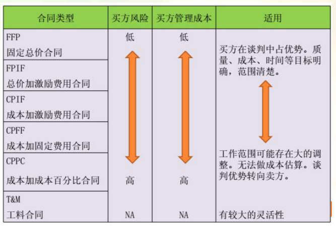

练习
> 1. 在某种特定合同下，确定有可列支成本作为供应商的补偿。供应商已获得102000美元的支付款项。其中80000美元为实际成本。 合同原始成本估算为90000美元，20000美元作为奖励酬金。对于实现成本节约，供应商获得其中的20%。这属于下列哪一个合同？
> 
> A.固定总价加激励合同 B.成本加固定费用合同 C.固定总价加经济价格合同 D.成本加激励合同 
> 
> 解答：D。节约成本90000-80000=10000美元*20%=2000美元，需支付80000+20000+2000=102000元。成本加激励 
> 
> 2. 一份成本加激励合同包含：100000的目标成本；20000的目标费用；30000的最高费用；15000的最低费用；80/20的分配比例。 项目实际成本为150000，项目完工时买房因支付的最终价格是：
> 
> A.150000 B.165000 C.170000 D.180000 
>  
> 解答：B。成本超支150000-100000=50000，按80/20比例分摊，卖方50000*20%=10000。费用20000-10000<15000，按15000支 付，故共需支付150000+15000=165000

# 补充 敏捷项目管理

## 敏捷宣言
- 个体和互动 高于流程和工具(Individuals and interactions over processes and tools)
- 工作的软件 高于详尽的文档(Working software over comprehensive documentation)
- 客户合作 高于合同谈判(Customer collaboration over contract negotiation)
- 响应变化 高于遵循计划(Responding to change over following a plan)

## 12 条敏捷原则
1. 我们最重要的目标，是通过**持续不断地**及早交付**有价值**的软件使客户满意。
2. 欢迎需求变化，即使在开发后期也一样。善于掌控变化，帮助客户获得竞争优势。
3. 经常地交付可工作的软件，相隔几星期或几个月，倾向于采取较短的周期。
4. 业务人员和开发人员必须每天在一起工作。
5. 激发个体的斗志，以他们为核心搭建项目。提供他们所需的环境和支持，相信他们能够达成目标。
6. 在团队内部，传递信息效果最高效的方式是面对面的交谈。
7. 可工作的软件是进度的首要度量标准。
8. 敏捷过程倡导可持续开发。责任人、开发人员和用户要能够共同维持其步调稳定延续。
9. 对技术精益求精，对设计不断完善，将提高敏捷能力。
10. 以简洁为本，极力减少不必要工作量。
11. 最好的架构、需求和设计出自于自组织的团队。
12. 团队定期地反省如何能提高成效，并由此调整团队的行为。

## SCRUM
### 两个角色
#### Scrum Master（不是项目经理，没有分配任务的权力，没有考核的权力，没有下命令的权力）
- 帮助团队铲除一切阻碍，让团队可以顺利完成冲刺目标
- 帮助团队最大化生产力
- 使用技术手段帮助团队变得更加高效，比如：引入自动化脚本，单元测试，持续集成等敏捷实践
- 协助团队和 PO 更好的进行协作
- 保证 Scrum 实践的正确推行

#### Product owner（PO）产品的负责人，需求负责人，
- 需求决策：哪个需求重要，哪个需求不重要，需求的优先级如何排列，在某次发布中要发布哪些需求是他来拍板的

## 三个文件
- **Product backlog**产品待办列表： 排序的列表，包含所有产品需求，PO 决定产品待办列表的内容、可用性和优先级。 
- **Sprint Backlog**待办事项列表，（相当于 WBS），来源于产品待办列表，更具体
- **燃尽图**是反映进度状态，也可以预测未来趋势

## 四个会议
### 计划会议（明确目标、细化任务） 
- 决定完成哪些任务
- 如何完成
### 每日立会（定时、定点、人齐、会短、高效） 
- 一个简短的团队会议，由团队的所有成员在每天固定的时间和地点进行
- **查看项目进展**，在会议中作计划，协调每日活动，还可以报告和讨论遇到的障碍
- 任务板能够帮助团队聚焦于每日活动之上，要在这个时候更新任务板和燃尽图。
- 会议上每个成员需要回答 3 个问题：
        1、你昨天做了什么？
        2、今天计划做什么？
        3、 是否遇到了障碍，需要其他人的帮助？
### 评审会（展示验收） 
- 小组向产品负责人**展示和验收**迭代工作结果。
- 产品负责人给出评价和反馈。
- 评审会上发现的**问题或改进将被累积到产品待开发项**，也不会马上或在下一个迭代中开发，
  而是由优先级排序决定何时开发。（**无需提变更请求**）

### 回顾会议（经验总结，识别改进） 
- 回顾团队在流程、人际关系以及工具方面做得如何。 
- 团队识别出哪些做得好，哪些做得不好，并找出潜在的改进事项为改进制定计划。

## 敏捷术语和概念
- 敏捷项目范围不固定，而时间和成本是固定的
- 敏捷使用自上而下的估计
- 敏捷文档通常勉强够用
- 敏捷有利于适应，而传统的管理方法有利于预期

**产品路线图(Product Roadmap)** 提供功能发布里程碑的高级概述。

**项目章程** 对于敏捷项目和传统项目都很重要，必须在敏捷项目开始时创建。

**帕累托原则** 也称为 80-20 规则指出，对于敏捷项目，80％的最有用的功能可以在 20％的努力中完成，强烈建议关注“20％”

**参与式设计** 通过积极让利益相关者参与设计过程来确保结果符合预期的设计方法。

**用户故事**
描述用户渴望得到的功能。
一个好的用户故事包括三个要素：
1. 角色：谁要使用这个功能。
2. 活动：需要完成什么样的功能或目标。
3. 商业价值：为什么需要这个功能，这个功能带来什么样的价值。

通常按照如下的格式来表达：
- 英文：As a <Role>, I want to <Activity>, so that <Business Value>.
- 中文：作为一个<角色>, 我想要<活动>, 以便于<商业价值>

3C：卡片(Card)、对话(Conversation)和确认(Confirmation)。 
- 卡片（Card）：用户故事一般在小卡片上写着故事的简短描述，工作量估算等。
- 交谈（Conversation）：用户故事背后的细节来源于和客户或者产品负责人的交流沟通。
- 确认（Confirmation）：通过验收测试确认用户故事被正确完成。

用户故事的六个特性- INVEST： 
- I dependent(独立的) 
- N egotiable(便于沟通的) 
- V aluable(有价值的) 
- E stimable(可估计的) 
- S mall(短小) 
- T estable(可测试的) 

# 整理
| 章节| 内容|
|---|---|
| |项目生命周期：管理周期 产品生命周期：启动到结尾
| |组织机构:矩阵型(职能经理+项目经理)
| |项目章程：任命项目经理动用资源，可交付，高层风险，相关方
| |项目管理计划:怎么做执行以及收尾
| |配置管理计划:指导如何配置，电脑环境等
| |沟通管理计划：信息传递，
| |相关方管理计划：相关方的期望
| |日志:假设日志(记录项目的制约因素启动阶段)  问题日志(监控过程) 变更日志(发生变更)
| |变更审批：章程变更(发起人) 基准变更(CCB)  紧急变更(PM)
| |收尾阶段变更：大可说服，小可变更
| |RBS 资源管理结构   RACI责任分配矩阵
| |项目进度管理：相对紧前活动，紧后活动提前叫做提前量
| |向关键路径要时间  非关键要资源
| |快速跟进会出现返工和风险。赶工增加成本
| |管理质量：是改进过程。
| |流程图找失效节点。散点图看两点变量关系
| |关键链是进度规划的一种,关键链末端的是项目缓冲;接驳缓冲,放在非关键链与关键链的接合点.
| |管理剩余缓冲持续 时间与活动之间的匹配
| |凸显模型用于识别确定相关方的相对重要性 适用于大型社区
| |资源管理计划:识别资源 获取资源 角色与职责 组织图 资源管理 培训 资源控制
| | |
|7-10|	确认范围是验收可交付成果的过程
|7-18|	全面质量管理是全面参与质量管理
|7-26|	根本原因分析是确定引起偏差或风险的分析.因果图比较宽泛 不特指偏差原因
|7-42|	执行整合依赖关系
| |	团队新进入成员 一般是形成阶段
| |	合作解决问题是综合考虑不同观点
| |	管理相关方参与是与相关方沟通以满足其需求和期望处理问题并促进相关方合理参与本过程.
|7-80|	成员分工不明确,可用raci或相关方分析
| |	范围明确用总价，范围变化用成本，工料是二者的混合型，规模小简单性质清楚
| |	创建wbs的输入:项目管理计划 文件 组织过程资产 事业环境因素
| |	在整个生命周期都要进行总结经验
| |	识别风险 定性分析风险(定量不一定可以做) 再制定策略 再应对
| |	raci更具体，并且唯一
| | |
|8-152|	风险,先识别风险,更新风险登记册,再分析风险,更新风险
|8-159|	风险过期,从风险登记册删除,删除风险以及应对措施.
|8-161|	敏感项目,客户提出的变更需要在下次迭代,不需要走变更流程
|8-143|	预防和质量评估有问题,需要通过变更改进过程来减少缺陷
|8-147|	收尾阶段工具:专家判断 法律法规 采购 审计 数据分析的偏差分析
|8-149|	进行质量审计有助于发现过程中的差距和不足
|8-1|	风险实施后,是否有效,需要通过风险审计判断有效性,专家判断是审计工具
|8-5|	精益六格玛是质量改进的举措
|8-5|	项目管理计划-资源管理计划-资源分解结构(成员的角色职责)
|8-10|	进度延迟使用,进度压缩,降低用户期望,使用变更
|8-22|	管理质量：提高质量目标；识别无效过程和导致低劣原因
| |	管理质量工具：核对单 过程分析 根本原因分析 因果图 质量审计
| |	根本原因分析：定义问题 分析创建因果图 找出方案 确定计划 跟进实施
|8-29|	质量管理计划:质量标准 目标 角色与职责 质量工具 质量控制活动
|8-30|	产品质量测量指标:包括故障 缺陷 客户满意度
|8-69|	事业环境因素 公司政策要求等
|8-88|	管理质量：面向X的设计(管理质量的一种)产品设计指南,目的为了优化控制或者提高特性
|8-89|	正式提出变更请求->全面分析影响->提交CCB->审批变更->记录变更日志->跟相关方沟通确认->执行变更
|8-143|	风险评估:专家判断是一种工具
|8-147|	已经发生的就不是风险,当问题处理
|8-148|	通过变更来改进过程
|8-149|	帕累托图 是排序的直方图
| |	直方图 是数字 展示图 展示缺陷的数量 不合格次数
| |	散点图 展示两个变量之间的图形 展示两支轴的关系
| | |
| |	使用相关方登记册来制定相关方参与计划
| |	使用应急储备时候,不需要走变更.
| |	大多数同意原则有利于公平。
| |	分享目标获得承诺，是开工大会
| |	预算不足考虑应急储备
| |	修改变更日志-再执行整体变更流程
| |	提出变更请求-全面分析-ccb审核-审核结果记录变更
| |	先更新相关方登记册--才能再更新 相关方参与计划
| |	wbs生成之前，可以修改需求，不需要提交变更请求
| |	为项目提供支持向前发展 是项目发起人作的.
| |	每日站会是敏捷项目，团队内部自己组织
| |	监管合规团队是事业环境因素.
| |	变更-变更日志   问题-问题日志
| |	敏捷开发：根据优先级进行迭代
| | |	
| |	确认范围是验收可交付成果的过程
| |	全面质量管理是全面参与质量管理
| |	根本原因分析是确定引起偏差或风险的分析.因果图比较宽泛 不特指偏差原因
| |	执行整合依赖关系
| |	团队新进入成员 一般是形成阶段
| |	合作解决问题是综合考虑不同观点
| |	管理相关方参与是与相关方沟通以满足其需求和期望处理问题并促进相关方合理参与本过程.
| |	成员分工不明确,可用raci或相关方分析
| |	范围明确用总价，范围变化用成本，工料是二者的混合型，规模小简单性质清楚
| |	创建wbs的输入:项目管理计划 文件 组织过程资产 事业环境因素
| |	在整个生命周期都要进行总结经验
| |	识别风险 定性分析风险(定量不一定可以做) 再制定策略 再应对
| |	raci更具体，并且唯一
| | |
|9-33|	敏捷项目 通过划分版本来管理功能和范围
|9-81|	概率和后果能评估优先级
|9-95|	更新风险管理计划需要 走流程
|9-133|	
| | |
|使用相关方登记册来制定相关方参与计划
|使用应急储备时候,不需要走变更.
|大多数同意原则有利于公平。
|分享目标获得承诺，是开工大会
|预算不足考虑应急储备
|修改变更日志-再执行整体变更流程
|提出变更请求-全面分析-ccb审核-审核结果记录变更
|先更新相关方登记册--才能再更新 相关方参与计划
|wbs生成之前，可以修改需求，不需要提交变更请求
|为项目提供支持向前发展 是项目发起人作的.
|每日站会是敏捷项目，团队内部自己组织
|监管合规团队是事业环境因素.
|变更-变更日志   问题-问题日志
|敏捷开发：根据优先级进行迭代
| | |
|风险,先识别风险,更新风险登记册,再分析风险,更新风险
|风险过期,从风险登记册删除,删除风险以及应对措施.
|敏感项目,客户提出的变更需要在下次迭代,不需要走变更流程
|预防和质量评估有问题,需要通过变更改进过程来减少缺陷
|收尾阶段工具:专家判断 法律法规 采购 审计 数据分析的偏差分析
|进行质量审计有助于发现过程中的差距和不足
|风险实施后,是否有效,需要通过风险审计判断有效性,专家判断是审计工具
|精益六格玛是质量改进的举措
|项目管理计划-资源管理计划-资源分解结构(成员的角色职责)
|进度延迟使用,进度压缩,降低用户期望,使用变更
|管理质量：提高质量目标；识别无效过程和导致低劣原因
|管理质量工具：核对单 过程分析 根本原因分析 因果图 质量审计
|根本原因分析：定义问题 分析创建因果图 找出方案 确定计划 跟进实施
|质量管理计划:质量标准 目标 角色与职责 质量工具 质量控制活动
|产品质量测量指标:包括故障 缺陷 客户满意度
|事业环境因素 公司政策要求等
|管理质量：面向X的设计(管理质量的一种)产品设计指南,目的为了优化控制或者提高特性
|正式提出变更请求->全面分析影响->提交CCB->审批变更->记录变更日志->跟相关方沟通确认->执行变更
|风险评估:专家判断是一种工具
|已经发生的就不是风险,当问题处理
|通过变更来改进过程
|帕累托图 是排序的直方图
|直方图 是数字 展示图 展示缺陷的数量 不合格次数
|散点图 展示两个变量之间的图形 展示两支轴的关系
| | |
|使用相关方登记册来制定相关方参与计划
|使用应急储备时候,不需要走变更.
|大多数同意原则有利于公平。
|分享目标获得承诺，是开工大会
|预算不足考虑应急储备
|修改变更日志-再执行整体变更流程
|提出变更请求-全面分析-ccb审核-审核结果记录变更
|先更新相关方登记册--才能再更新 相关方参与计划
|wbs生成之前，可以修改需求，不需要提交变更请求
|为项目提供支持向前发展 是项目发起人作的.
|每日站会是敏捷项目，团队内部自己组织
|监管合规团队是事业环境因素.
|变更-变更日志   问题-问题日志
|敏捷开发：根据优先级进行迭代
| | |
|确认范围是验收可交付成果的过程
|全面质量管理是全面参与质量管理
|根本原因分析是确定引起偏差或风险的分析.因果图比较宽泛 不特指偏差原因
|执行整合依赖关系
|团队新进入成员 一般是形成阶段
|合作解决问题是综合考虑不同观点
|管理相关方参与是与相关方沟通以满足其需求和期望处理问题并促进相关方合理参与本过程.
|成员分工不明确,可用raci或相关方分析
|范围明确用总价，范围变化用成本，工料是二者的混合型，规模小简单性质清楚
|创建wbs的输入:项目管理计划 文件 组织过程资产 事业环境因素
|在整个生命周期都要进行总结经验
|识别风险 定性分析风险(定量不一定可以做) 再制定策略 再应对
|raci更具体，并且唯一
| | |
|项目生命周期：管理周期 产品生命周期：启动到结尾
|组织机构:矩阵型(职能经理+项目经理)
|项目章程：任命项目经理动用资源，可交付，高层风险，相关方
|项目管理计划:怎么做执行以及收尾
|配置管理计划:指导如何配置，电脑环境等
|沟通管理计划：信息传递，
|相关方管理计划：相关方的期望
|日志:假设日志(记录项目的制约因素启动阶段)  问题日志(监控过程) 变更日志(发生变更)
|变更审批：章程变更(发起人) 基准变更(CCB)  紧急变更(PM)
|收尾阶段变更：大可说服，小可变更
|RBS 资源管理结构   RACI责任分配矩阵
|项目进度管理：相对紧前活动，紧后活动提前叫做提前量
|一倍 两倍 3倍 4倍 68.26% 95.46% 99.73% 99.99%  标准差=
|向关键路径要时间  非关键要资源
|快速跟进会出现返工和风险。赶工增加成本
|管理质量：是改进过程。
|流程图找失效节点。散点图看两点变量关系
|关键链是进度规划的一种,关键链末端的是项目缓冲;接驳缓冲,放在非关键链与关键链的接合点.
|管理剩余缓冲持续 时间与活动之间的匹配
|凸显模型用于识别确定相关方的相对重要性 适用于大型社区
|资源管理计划:识别资源 获取资源 角色与职责 组织图 资源管理 培训 资源控制

# 风险与变更

题目的解题思路

## 需要解决的问题
### 问题一：风险和变更的题目考什么？
#### 两个步骤：
- 分析典型例题
- 总结题目特点

##### 典型例题
> 例题1：
客户同意在开展数据中心项目期间最多中断两小时。但由于一
些外部因素，中断时间超过了两小时时间范围。项目经理应该
怎么做？
（B）
• A.更新风险登记册，并与干系人沟通
• B.要求团队创建权变措施，并提交变更请求延长进度计划
• C.安排一次会议，确定根本原因
• D通知客户，并安排一次会议创建权变措施

> 例题2：
由于个人原因，一名项目团队成员通知项目经理将不能工作两
周时间。该团队成员是能够执行一项关键路径任务的唯一资源。
项目经理应该首先更新以下哪份文件？
（D）
• A.工作分解结构
• B.风险登记册
• C.人力资源管理计划
• D.项目进度计划

> 例题3：
在项目执行阶段，新项目经理接管项目，所有项目文件均已交
接。新项目经理确认已经使用了50%的预算，成本绩效指数CPI
为1.05，进度绩效指数为0.75。项目经理下一步应该怎么做？
（C）
A.签发变更请求
B.更新变更管理计划
C.赶工或快速跟进
D.审查范围管理计划

#####  总结题目特点
- 考查风险和变更的题目以情景题为主；题目通常为发生或可能发生某一事件，导致项目出现异常情况或状态；
- 考查风险和变更的题目落脚点通常为流程步序辨析；
- 题目通常有“下一步”、“首先”、“应该”、“本应该”等表示流程顺序的关键词；
- 在进行流程步序判断前，有时需要先确定执行哪个

#### 风险和变更的题目考什么？
- 考查风险与变更的辨析
- 考查流程步序的辨析
  - 考察风险管理流程
  - 考查变更控制流程

### 问题二：如何判断风险和变更？
#### 两个步骤：
- 回到定义中去
- 厘清风险与变更的区别与联系

##### 回到定义中去
> 项目风险：
项目风险是一种不确定的事件或条件，一旦发生就会对一个或多个项目目标造成积极或消极的影响，如范围、进度、成本和质量。（PMBOK,P310）

> 项目变更：
当项目实际与项目管理计划已 经或者确定将会发生偏离时，对可交付成果、项目管理计划或项目文件进行调整，从而使项目实际与项目管理计划保持一致的活动。（PMBOK,P89、P92）

##### 风险与变更的区别与联系
- 风险与变更本身是两个管理维度的概念，二者本身并没有直接的逻辑关系；
- 风险是指项目过程中可能遇到的具体事件或条件，而变更是应对项目偏离预期的一种管理活动或手段；
- 风险的应对措施可能会需要提交变更请求，项目的变更也可能会带来一定风险。

#### 如何判断风险和变更？
- 事件是否确定发生
  - 可能性事件：风险
  - 确定性事件：项目偏离预期的问题会引起变更
- 事件是否是否影响项目目标

#### 风险和变更流程的基本思路

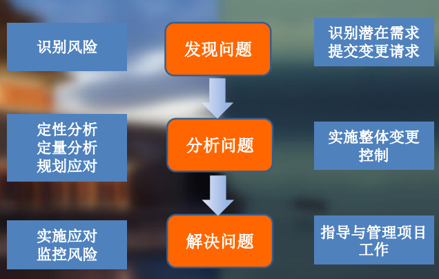

#### 风险管理和变更控制追求的效果
- 项目风险管理：
  - 将项目过程中的种种可能变为可控；
  - 将有限的项目资源投入到应对那些更可能发生或影响更大的事件上去；
- 项目变更控制：
  - 将项目实际与项目计划的离散变为收敛；
  - 根据项目管理计划确定的颗粒度，控制所有会导致项目无法达到预期结果的行为。

风险与变更有相同的管理思路、相似的管理程序，但管理行为追求不同的效果和不同的成本效益关系，相互间不能替代

### 问题三：风险和变更的具体流程是什么？
- 风险管理流程
- 变更控制流程

#### 风险管理流程
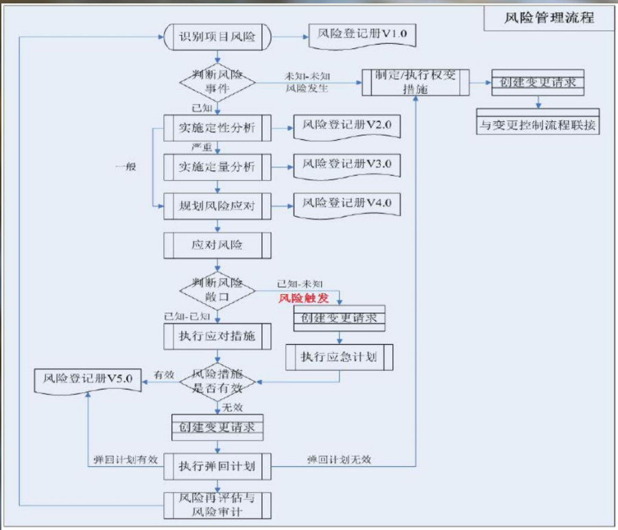

##### 风险管理流程.TIPS
采取不同类型风险应对策略的时机有差异，具体如下：
- 规避(开拓)、减轻(增强)、转移(共享)应对策略，确定后即可执行；
- 接受应对策略或权变措施，待风险事件发生后执行；
- 应急应对策略应设置预警信号，在触发条件被满足后执行；
- 弹回计划，在识别到主应对策略未达到预期效果时执行（弹回计划可视为特殊的应急计划）。

以下情况，实施风险应对策略可能导致变更：
- 已知-已知风险，在项目管理计划批准后确定应对策略；
- 已知-未知风险，执行应急计划之前(审查风险登记册之后)； 
- 主应对计划无效而需要执行弹回计划之前；
- 未知-未知风险，在执行权变措施之后；
- 使用管理储备之前。

关于储备分析，有以下方面需要注意：
- 应急储备作为风险应对策略的一部分，在规划应对策略同时设置；
- 应针对不同的风险事件，在活动或工作包层面设置应急储备；
- 应急储备用来执行接受策略、部分减轻策略和应急应对策略；
- 管理储备用来应对不可预见的项目工作，包括执行权变措施以及

应急储备不足的情况。

#### 变更控制流程
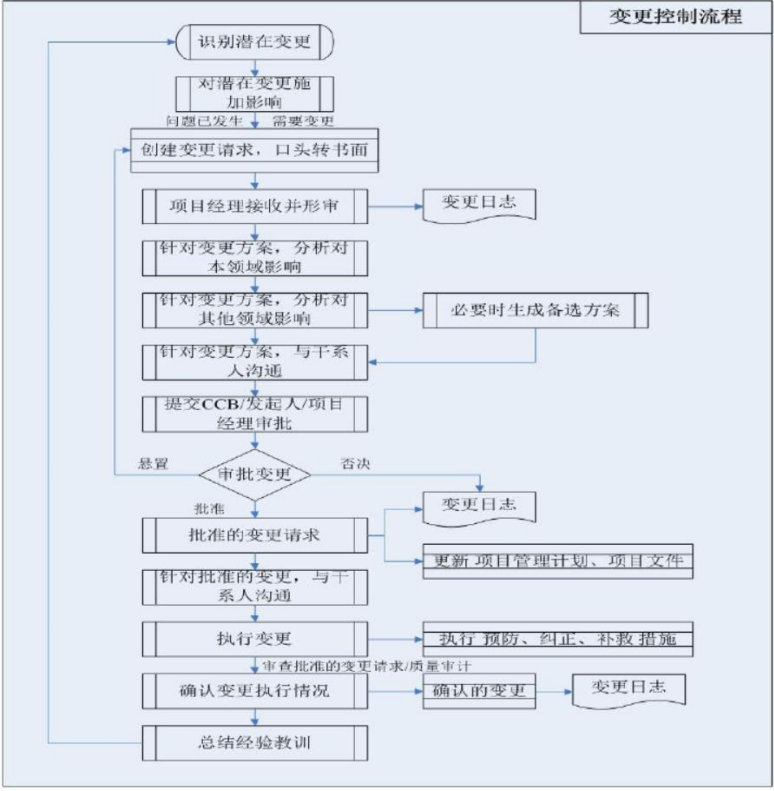

##### 变更控制流程.TIPS
关于潜在变更，需要完成以下工作：
- 尽早识别潜在变更；
- 引导和推进对项目“有益的”潜在变更发生；
- 提前采取措施应对“有害的”潜在变更对项目施加影响；
- 克服变更的阻力。变更只是一种手段，本身不会对项目产生有益或有害的效果，需要影响的是导致潜在变更发生的事件。

关于变更请求与实施整体变更控制过程的关系：
- 变更请求是实施整体变更控制的输入，并不是这个过程的一部分；
- 变更请求由其他16个过程输出（1个规划过程、5个执行过程、10个监控过程），将这16个过程识别到的变更联接到实施整体变更控制过程进行分析、决策和其他处理；
- 任何相关方都可以提出变更请求，但均需要由项目经理进行书面化和形式审查后，才作为实施整体变更控制的输入。

关于变更请求的审批权限：
- 变更请求的审批权限通常根据项目执行组织的政策确定，并在变更管理计划中明确；
- 一般情况下，不涉及基准的变更由项目经理审批，影响基准的由CCB审批，涉及项目章程的变更可能还需要由发起组织审批；
- 紧急情况下，可由项目经理先审批和执行变更，后续再补办审批；
- 未按要求审批的变更，一旦发现应补办审批。

变更日志与问题日志
- **变更日志**用来记录项目过程中出现的变更、变更请求的审批结果、变更方案的实施计划、变更方案的实施结果；
- **问题日志**用来记录和监督项目相关方的讨论事项或争议事项，问题日志的三要素包括：问题事件、责任人和解决期限；

### 风险和变更题目的解题思路
- 完整读题，标注题眼（情境中的异常状态）和关键词；
- 回到定义中去，判断题目考察风险还是变更；
- 回顾风险/变更流程图；
- 定位题目状态，锁定正确答案。

复习方法
```shell
    书中释义
   /       \
强化训练 --- 循环总结
```

# 项目质量管理
需要解决的问题
- 问题一 PMP对项目质量管理的要求有何变化？
- 问题二 项目质量管理与质量管理体系有何联系？
- 问题三 项目质量管理考什么？

## 问题一 PMP对项目质量管理的要求有何变化？
三个角度分析

1. PMBOK第六版关于质量管理的变化
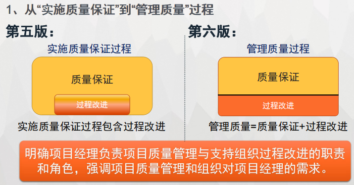
   
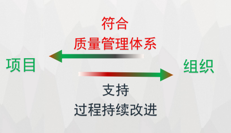

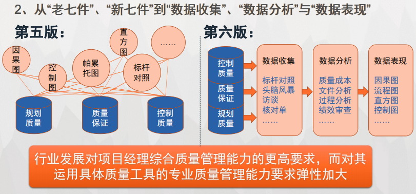

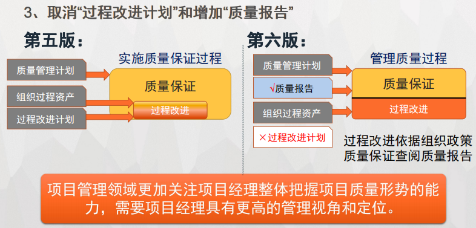

2. 注册质量经理认证的推广

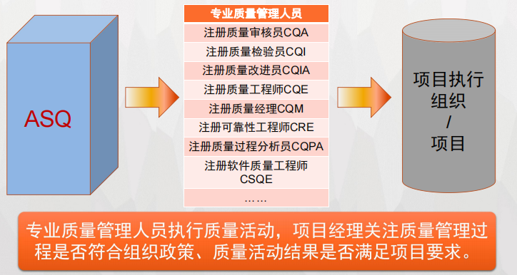

3. 项目质量管理过程

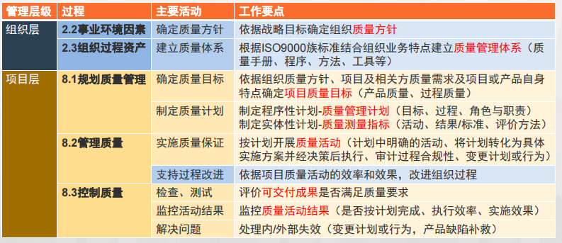

- 项目质量管理倾向于直接运用或剪裁执行组织 质量管理体系提供的程序、方法和工具； 
- 项目通过质量管理活动实践组织程序，以支持 组织过程的持续改进； 
- 项目经理需要具备综合质量管理能力，整体把 握项目质量形势，具体质量活动趋向于由专业 质量管理人员负责。

## 问题二 项目质量管理与质量管理体系有何联系？
### 定义
#### 项目质量管理： 
项目质量管理是把组织 的质量政策应用于规划、 管理和控制项目及产品 质量要求，以满足相关 方目标的各个过程，并 以组织的名义支持过程 的持续改进活动。 
#### 质量管理体系： 
采用质量管理体系是组织 的一项战略决策，能够帮 助组织提高整体绩效，为 推动可持续发展奠定良好 基础。质量管理体系要求 是对产品和服务要求的补 充。 

质量管理体系为项目质量管理提供制度和方法基础 项目质量管理将质量管理体系与项目质量要求对接

### 工作方法 
#### 项目质量管理： 
采用IPECC过程方法， 剪裁应用组织的质量管 理程序和方法，同时兼 顾项目与产品的质量管 理要求。 
#### 质量管理体系： 
采用过程方法，结合 PDCA循环和基于风险管 理的思维。 

质量管理体系与项目质量管理采用相似的工作方法 体系为项目提供方法基础，项目为体系提供实践数据

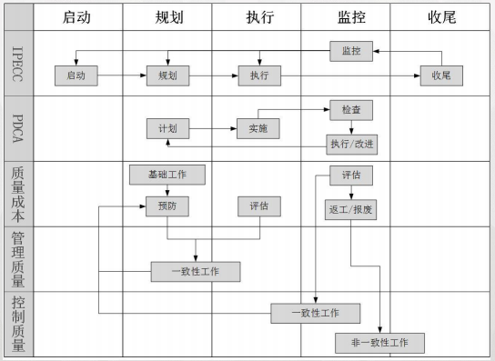

### 核心内容与原则 
#### 项目质量管理： 
a.客户满意 
b.管理层的责任 
c.所有人的共同职责 
d.预防胜于检查 
e.持续改进 
f .与供应商的互利合作 
g.质量成本（一次性） 
#### 质量管理体系： 
a.以顾客为关注焦点 
b.领导作用 
c.全员参与 
d.一次将事情做对 
e.改进 
f .关系管理 
g.循证决策（持续改进） 

质量管理体系与项目质量管理具有基本一致的核心内容与原则 体系关注提升组织质量管理水平，项目致力于提供满足要求的产品

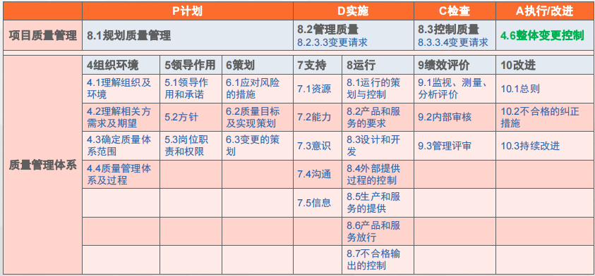

- 体系为项目提供方法基础，项目为体系识别过 程改进机会； 
- 体系决定项目质量基础，项目决定组织质量管 理高度； 
- 体系关注所有项目总体成功，项目关注满足自 身要求。

## 问题三 项目质量管理考什么？
### 四个层次：
#### 质量意识 
按有效性递增的五种质量管理成熟度模型
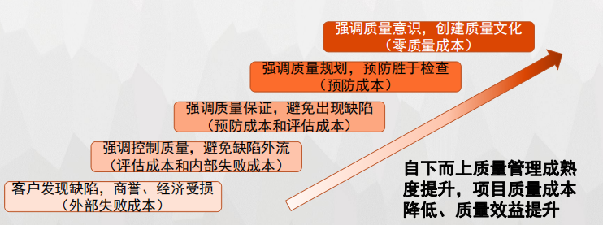

项目经理应具备以下质量意识： 
- 一次把事情做对、质量是免费的、预防胜于检查、凯思恩这些重 要的质量管理理念都是在追求向更高的质量管理成熟度层级递进；
- 通常情况下，达到更高质量管理成熟度层级的组织或项目会获得 更好的质量管理效果和成本效益关系； 
- 质量管理成熟度各层级间并非阶跃关系，达到高层级的组织或项 目仍然可能需要开展低层级的质量管理活动，但侧重不同； 
- 应根据执行组织或项目自身特点和限制选择适合的成熟度层级。

PMP考题形式： 
考查质量意识的题目，通常设置不同情景、活动或工具/技术的选项，
在全部或部分都可以满足题目假设的情况下，需要判断哪 个选项的做法可获得更好的质量管理效果。
这类题目可以通过选项 所对应的质量管理成熟度层级高低进行判断。
#### 质量规划
根据项目一次性和独特性的特点，项目质量管理应追求适当的 管理程度。即在有限的资源范围内，通过规划质量活动，利用更少 的质量成本提供恰好满足客户需求程度的可交付成果。 

质量规划的核心就是通过成本效益分析、质量成本（分析）以 及边际分析等手段，确定最佳质量标准和实现这一标准的质量活动 组合方案，使质量管理过程达到边际效益等于边际成本的平衡点。

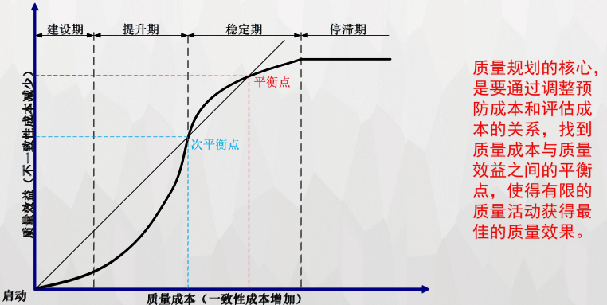

伴随质量成本不断增加，质量管理过程可划分为以下阶段：

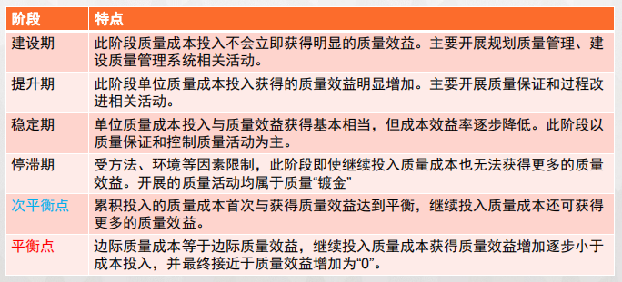

PMP考题形式： 
考查质量规划的题目，通常需要判断不同质量活动对应一致性 质量成本和不一致性质量成本之间的成本效益关系。
在现代质量管 理思想框架下，项目和组织普遍期望预防成本占比最大，
其次是评 估成本，而尽可能减少内部失败成本，并极力避免外部失败成本。

#### 质量管理过程之间的关系

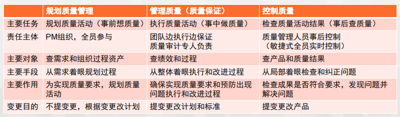

PMP考题形式： 
考查质量管理过程关系的题目，通常设置不同质量活动或工具作为选项，需要通过题目描述的问题情景判断所对应的质量管理过程， 从而缩小备选答案范围。
#### 质量管理工具/技术辨析
##### 1. 数据收集
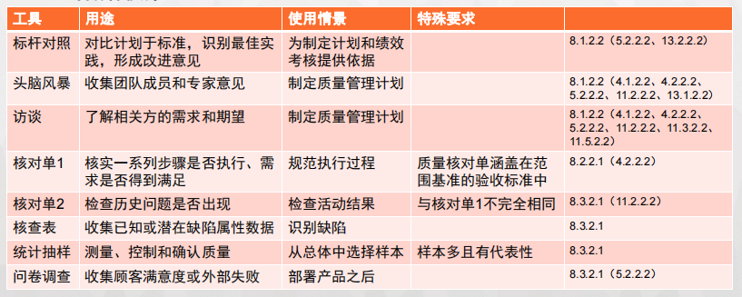

##### 2. 数据分析
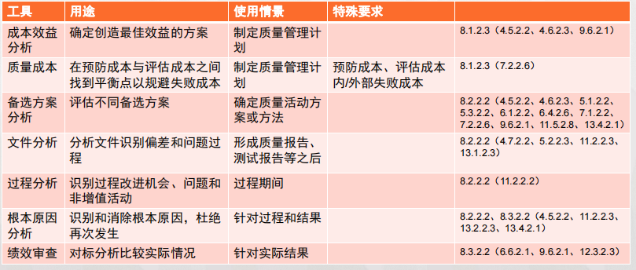

##### 3. 数据表现
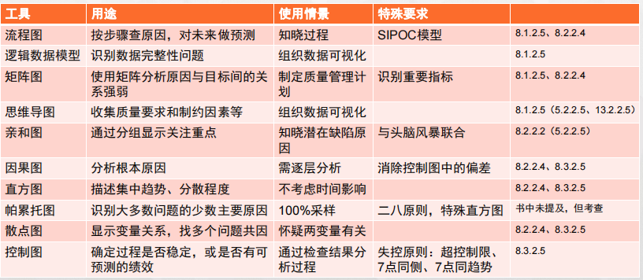

#####  4. 其他新增工具/技术 
1）面向X的设计8.2.2.6 

基于预防胜于检查和一次把事情做对的质量管理思想，通过一系列质量活动，把质量要求融入产品设计中去，从而优化产品设计、控制和提高产品特性以满足相关方需求和期望。

面向X的设计Df （X）中的X指客户或项目对产品质量的某方面要求，
可能针对可靠性、安全性、测试性、环境适应性等通用质量特性，
也可能针 对降低质量成本、提高客户满意度等总体质量效果。

项目团队主要关注执行过程和质量活动如何将X融入产品设计；项目经理主要关注X是否得到满足。

2）测试/产品评估8.3.2.4 
测试/产品评估指有组织的、结构化地调查，根据项目需求提供被测对象质量的客观信息，并尽早发现不合格问题。

与“检查8.3.2.3”的关系： 检查指检验工作产品以确定是否符合书面标准。 

检查：属性抽样，以定性评价为主，结果为是否满足验收标准； 

测试：变量抽样，以定量测量为主，结果为产品符合要求的程度。

PMP考题形式： 
考查质量管理工具/技术辨析的题目，通常针对名称或作用相 近的工具设置选项，
需要熟悉不同质量管理工具的作用、特点和使 用情景，厘清这些工具间的详细差异，
并能够结合题目描述的阶段、 状态和限制条件，准确判断哪个选择可以达到预期效果