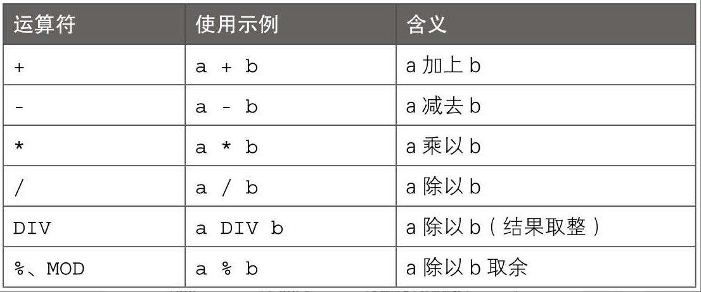
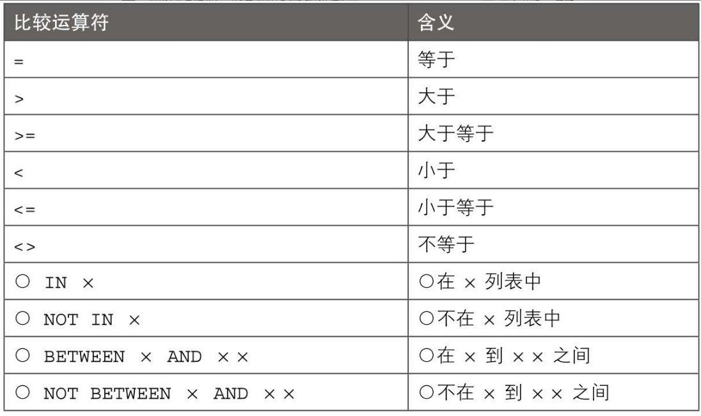
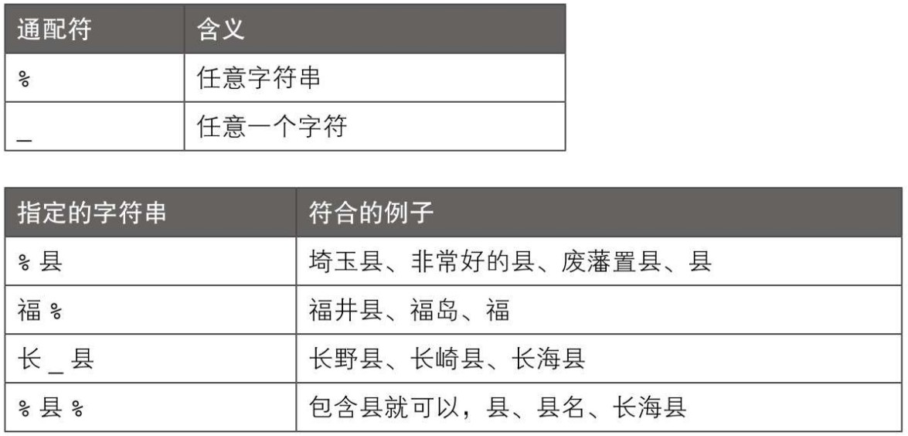
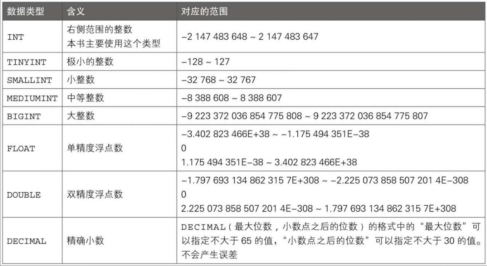
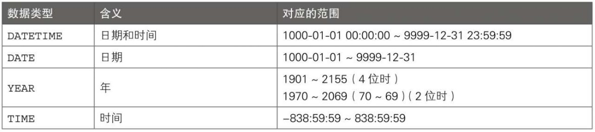

# SQL
## 使用mysqladmin命令创建和删除数据库
mysqladmin -u 用户名 -p密码 CREATE 数据库名

mysqladmin -u 用户名 -p密码 DROP 数据库名

mysql 数据库名 -u 用户名 -p密码 -e "命令"

# 数据库
## 创建数据库
CREATE DATABASE 数据库名;

## 删除数据库
DROP DATABASE 数据库名;

## 显示所有数据库
SHOW DATABASES;

## 指定使用数据库
USE 数据库名;

# 数据表
## 显示所有表
SHOW TABLES;

## 创建表
CREATE TABLE 表名(列名 数据类型, column_name data_type, ...);
### 复制表
CREATE TABLE 新表名 SELECT * FROM 旧表名;
#### 仅复制表结构
CREATE TABLE 新表名 LIKE 旧表名;

### 删除表
DROP TABLE 表名;
DROP TABLE IF EXISTS 表名;

## 显示表的列结构
DESC 表名;

## 设置主键
PRIMARY KEY

## 设置唯一键
UNIQUE

AUTO_INCREMENT

DEFAULT

# 数据记录
## 1. 增
### 向表中插入数据
INSERT INTO 表名 VALUES(数据1, 数据2, ...);
INSERT INTO 表名 (列名1, column_name2, ...) VALUES(数据1, 数据2, ...);
INSERT INTO 表名 SELECT * FROM 元表名;
INSERT INTO 表名(列名) SELECT (某元表列名) FROM 元表名;

## 2. 删
### 删除所有记录
DELETE FROM 表名;

## 3. 改
### 修改表 列
#### 修改列数据类型
ALTER TABLE 表名 MODIFY 列名 数据类型;
#### 新增列
##### 默认位置
ALTER TABLE 表名 ADD 列名 数据类型;
##### 最前
ALTER TABLE 表名 ADD 列名 数据类型 FIRST;
##### 任意位置
ALTER TABLE 表名 ADD 列名 数据类型 AFTER 某列名;

ALTER TABLE ... CHANGE ...
#### 删除列
ALTER TABLE 表名 DROP 列名;

### 更新记录
#### 更新所有记录
UPDATE 表名 SET 列名=设置的值

## 4. 查
### 访问其他数据库
SELECT * FROM 数据库名.表名;

### 查询
SELECT 条件 FROM 表名;

#### 使用别名
SELECT 列名 AS 别名 FROM 表名;

#### 使用算术运算
SELECT 计算值 AS 别名 FROM 源;


#### 使用函数
SELECT 函数名(参数) FROM 表名;
> 1. 算平均值
> 
> SELECT AVG(列名) FROM 表名;
> 2. 求和
> 
> SELECT SUM(列名) FROM 表名;
> 3. 显示个数
> 
> SELECT COUNT(列名) FROM 表名;
> 4. 返回圆周率
> 
> SELECT PI()
> 5. 显示MySQL服务器版本
> 
> SELECT VERSION()
> 6. 显示当前用户
> 
> SELECT USER()
> 7. 显示当前数据库
> 
> SELECT DATABASE()
> 8. 连接字符串
> 
> SELECT CONCAT(..., 列名, ...) FROM 表名;
> 9. 从左右取出
> 
> SELECT RIGHT(列名, n_chars) FROM 表名;
>
> SELECT LEFT(列名, n_chars) FROM 表名;
>
> SELECT SUBSTRING(列名, start, end) FROM 表名;
> 
10. 最大值/最小值
> MAX()/MIN()

### 创建索引
CREATE INDEX 索引名 ON 表名 (列名);
SHOW INDEX 索引名 FROM 表名;
DROP INDEX 索引名 ON 表名;

### 设置条件
SELECT 列名 FROM 表名 LIMIT 显示的记录数;

### 提取记录
SELECT 列名 FROM 表名 WHERE 条件;


#### 模糊查询LIKE
#### 字符串通配符


#### NULL作为条件
IS NULL

IS NOT NULL

#### 去重
DISTINCT

### CASE WHEN
```roomsql
CASE
    WHEN 条件1 THEN 显示的值
    WHEN 条件1 THEN 显示的值
    WHEN 条件1 THEN 显示的值
...
ELSE 不满足所有条件显示的值
END
```
### 排序
SELECT 列名 FROM 表名 ORDER BY 作为键的列;
SELECT 列名 FROM 表名 ORDER BY 作为键的列 ASC;
SELECT 列名 FROM 表名 ORDER BY 作为键的列 DESC;

### 指定显示范围
SELECT 列名 FROM 表名 LIMIT 显示的记录数 OFFSET 开始显示记录的移位数

### 分组显示
SELECT 列名 FROM 表名 GROUP BY 用于分组的列名;

### 按组处理
SELECT 统计列 FROM GROUP BY 分组列 HAVING 条件;

```roomsql
SELECT
    id,AVG(sales)
FROM tb
    WHERE sales>=50
GROUP BY id
    ORDER BY AVG(sales)
DESC;
```

### 多表操作
#### 合并 UNION/UNION ALL
(SELECT * FROM 表1) UNION (SELECT * FROM 表2)

(SELECT * FROM 表1) UNION ALL (SELECT * FROM 表2)
#### 内连接 JOIN/INNER JOIN
**只会提取与连接键相匹配的记录**

SELECT * FROM 表1 JOIN 表2 [ON 表1.某列=表2.某列];

SELECT * FROM 表1 INNER JOIN 表2 [ON 表1.某列=表2.某列];

SELECT * FROM 表1 INNER JOIN 表2 USING(公共列);
#### 外连接 LEFT JOIN/RIGHT JOIN
SELECT * FROM 表1 LEFT JOIN 表2 ON 表1.某列=表2.某列;

SELECT * FROM 表1 RIGHT JOIN 表2 ON 表1.某列=表2.某列;

#### 自连接 JOIN/INNER JOIN
SELECT * FROM 表1 AS 别名1 JOIN 表1 AS 别名2;

### 子查询
SELECT 列名 FROM 表名 WHERE 列名 IN (SELECT * FROM 表名);

内连接

SELECT 表1.列名 ... FROM 表1 JOIN 表2 ON 表1.某列=表2.某列;

# 数据类型
## 常用数值型数据类型


## 常用字符串数据类型


## 常用日期数据类型


# 视图

# 存储过程 PROCEDURE
```roomsql
delimiter //
CREATE PROCEDURE 过程名(参数 参数类型, ...)
BEGIN
语句1
语句2
...
END
//
delimiter ;

CALL 过程名(参数, ...);
DROP PROCEDURE 过程名;
```

# 存储函数 FUNCTION

# 触发器 TRIGGER

# 事务 TRANSACTION;